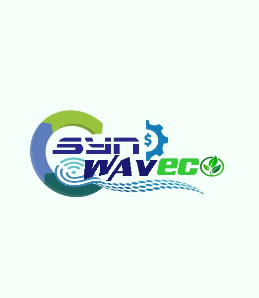
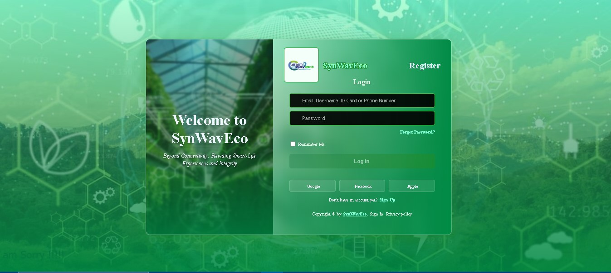
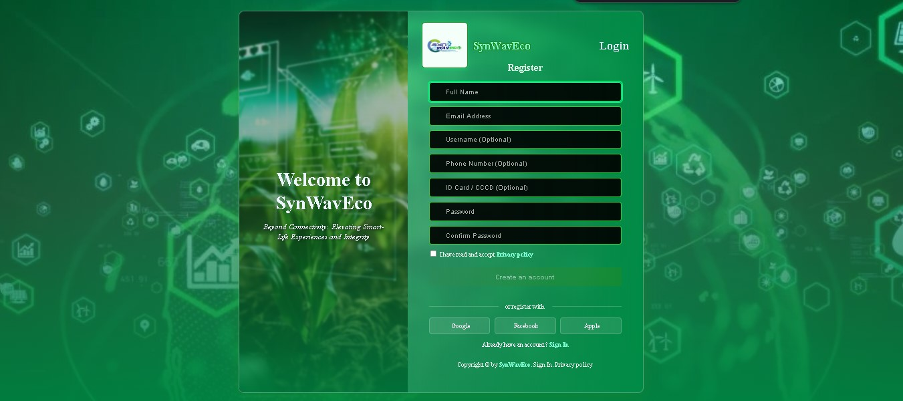

<p align="center">
  
  &nbsp;&nbsp;&nbsp;&nbsp;
  
</p>


# 🌊💚 SynWaveEco - Nền Tảng Thương Mại Điện Tử & Quản Lý Thiết Bị IoT Thông Minh

> **Hơn cả sự kết nối: Nâng tầm trải nghiệm sống thông minh và trọn vẹn.**

---

## 📌 Mục lục
- [💡 Giới thiệu dự án & Bài toán giải quyết](#-giới-thiệu-dự-án--bài-toán-giải-quyết)
- [🏢 Mô hình kinh doanh (Business Model)](#-mô-hình-kinh-doanh-business-model)
- [✨ Các tính năng nổi bật](#-các-tính-năng-nổi-bật)
- [🖥️ Giao diện & Luồng nghiệp vụ (Demo Images)](#️-giao-diện--luồng-nghiệp-vụ-demo-images)
- [🛠️ Công nghệ sử dụng (Technology Stack)](#️-công-nghệ-sử-dụng-technology-stack)
- [🗃️ Cấu trúc cơ sở dữ liệu (Database Schema)](#️-cấu-trúc-cơ-sở-dữ-liệu-database-schema)
- [📁 Cấu trúc thư mục nguồn](#-cấu-trúc-thư-mục-nguồn)
- [⚙️ Hướng dẫn cài đặt & Triển khai](#️-hướng-dẫn-cài-đặt--triển-khai)
- [🔑 Tài khoản kiểm thử mẫu](#-tài-khoản-kiểm-thử-mẫu)
- [🚀 Định hướng & Liên hệ thực tiễn](#-định-hướng--liên-hệ-thực-tiễn)
- [🎓 Thành viên phát triển](#-thành-viên-phát-triển)

---

## 💡 Giới thiệu dự án & Bài toán giải quyết

### 1. Bối cảnh & Bài toán thực tiễn
Trong xu thế chuyển đổi số quốc gia (Vietnam 4.0), nhu cầu ứng dụng công nghệ thông minh vào sản xuất nông nghiệp (Smart Farming), quản trị hộ gia đình (Smart Home) và giám sát an ninh tại các doanh nghiệp nhỏ đang gia tăng mạnh mẽ. Tuy nhiên, khách hàng và lập trình viên hiện tại đang đối mặt với các khó khăn lớn:
*   **Sự phân mảnh linh kiện:** Người mua khó khăn khi tìm kiếm các giải pháp IoT được tích hợp sẵn dưới dạng gói giải pháp hoàn chỉnh (Solution Kits) thay vì các linh kiện rời rạc.
*   **Thiếu hụt tài liệu kỹ thuật chuyên sâu:** Các trang thương mại điện tử phổ thông không cung cấp thông tin kỹ thuật chi tiết của thiết bị như CPU, RAM, giao thức kết nối, điện năng tiêu thụ,...
*   **Khoảng trống quản lý sau bán hàng:** Hầu hết các nền tảng e-commerce chỉ dừng lại ở bước giao dịch mua bán. Người dùng mua thiết bị IoT về không có một nền tảng tập trung để quản lý hoạt động, cấu hình thông số đo lường hoặc thiết lập cảnh báo an toàn.

### 2. Giải pháp SynWaveEco
**SynWaveEco** là nền tảng Thương mại Điện tử chuyên biệt kết hợp **Hệ thống Quản lý Thiết bị IoT Sau Bán Hàng** được xây dựng trên nền tảng PHP Laravel 12.
*   **E-Commerce Chuyên Biệt:** Kênh phân phối linh kiện điện tử, vi điều khiển (Arduino, ESP32, STM32...) và các gói giải pháp IoT đóng gói sẵn. Dữ liệu bán hàng được tách biệt rõ ràng với dữ liệu thông số kỹ thuật chi tiết để phục vụ đối tượng lập trình viên và doanh nghiệp.
*   **Module Giám Sát IoT Độc Quyền (Post-Sale IoT Device Management):** Cho phép người mua đăng ký thiết bị vật lý đã sở hữu lên hệ thống, quản lý cấu hình các chỉ số thu thập (`device_metrics`) và thiết lập các ngưỡng cảnh báo an toàn (`alert_thresholds` - min/max) để tối ưu hóa vận hành thiết bị.
*   **Cổng Tri Thức (Knowledge Hub):** Tích hợp thư viện bài viết hướng dẫn lắp đặt phần cứng, các giải pháp ứng dụng thực tế và diễn đàn kỹ thuật giúp kết nối người dùng và đội ngũ phát triển.

---

## 🏢 Mô hình kinh doanh (Business Model)

*Mô hình kinh doanh của SynWaveEco đóng vai trò bổ trợ và định hình cho các luồng nghiệp vụ trên hệ thống công nghệ:*

### 1. Mô hình phân phối đa kênh
SynWaveEco vận hành theo mô hình thương mại điện tử **B2C (Business-to-Consumer)** với chiến lược đa kênh nhằm tiếp cận khách hàng tối ưu nhất:
*   🌐 **Website & Hỗ trợ:** [Facebook Fanpage](https://www.facebook.com/official.synwaveco/) (Cổng giao tiếp chính thức)
*   🏪 **Gian hàng Shopee:** [shopee.vn/synwaveco](https://shopee.vn/synwaveco) (Kênh phân phối chính thức)
*   📱 **Kênh Social Media:** Kênh [TikTok @synwaveco](https://www.tiktok.com/@synwaveco) & [Facebook SynWaveEco](https://www.facebook.com/official.synwaveco/)
*   📺 **Kênh YouTube:** [YouTube @synwaveco](https://www.youtube.com/@synwaveco) (Kênh hướng dẫn kỹ thuật & giải pháp)

### 2. Tệp khách hàng mục tiêu
*   👨‍👩‍👧‍👦 **Urban Tech Enthusiasts:** Nhóm gia đình trẻ, đam mê công nghệ muốn tự cấu hình các gói Smart Home giá rẻ.
*   👨‍🌾 **Smart Farmers:** Các hộ nông dân, doanh nghiệp nông nghiệp muốn áp dụng nông nghiệp chính xác (giám sát đất đai, tưới tiêu tự động thông qua cảm biến).
*   🏢 **SOHO (Small Office / Home Office):** Cửa hàng tiện lợi, văn phòng nhỏ cần giải pháp giám sát nhiệt độ kho bãi và cảnh báo tự động.

---

## ✨ Các tính năng nổi bật

| Biểu tượng | Vai trò/Tính năng | Mô tả chi tiết kỹ thuật |
| :---: | --- | --- |
| 🛒 | **Quy trình E-Commerce toàn diện** | Luồng mua hàng hoàn chỉnh gồm: Duyệt sản phẩm, Tìm kiếm thông minh, Bộ lọc nâng cao (theo danh mục/nhà sản xuất), Giỏ hàng real-time tương tác mượt mà và Trang thanh toán tối ưu hóa UI/UX. |
| 🛡️ | **Phân quyền người dùng đa cấp** | Kiểm soát an ninh bằng `RoleMiddleware` phân quyền nghiêm ngặt 4 nhóm người dùng: **Admin** (Quản trị toàn diện), **Saler** (Quản lý kho & đơn hàng), **Shipper** (Cập nhật vận chuyển) và **Customer** (Khách hàng). |
| 📊 | **Module Quản lý IoT Sau Bán Hàng** | Giao diện Admin cho phép đăng ký thiết bị IoT (`iot_devices`), định nghĩa các chỉ số kỹ thuật đo lường vật lý và thiết lập các ngưỡng giá trị cảnh báo (`alert_thresholds`) để mô phỏng hoạt động thực tế. |
| 📑 | **Cấu trúc Dữ liệu Chuyên Sâu** | Tách biệt thông tin thương mại (`products`) và thông số chi tiết phần cứng (`product_details`: CPU, RAM, Điện năng, Chuẩn kết nối) giúp cơ sở dữ liệu hoạt động ổn định và tối ưu tìm kiếm kỹ thuật. |
| 📧 | **Tự động gửi hóa đơn & thông báo** | Hệ thống tự động kích hoạt gửi mail xác nhận chi tiết đơn hàng đến địa chỉ email của khách hàng ngay sau khi đặt hàng thành công (`PlaceOrderSuccessEmail.php`). |
| 🔄 | **Nhập/Xuất Dữ liệu Excel/CSV** | Tích hợp thư viện `Maatwebsite/Laravel-Excel` cho phép Admin và Saler nhập/xuất hàng loạt danh sách sản phẩm, danh mục hàng hóa nhằm rút ngắn thời gian cập nhật kho. |
| 📚 | **Cổng Tri Thức (Knowledge Hub)** | Hệ thống quản lý bài viết công nghệ, chia sẻ dự án IoT mẫu và giải pháp thực tế, liên kết trực tiếp đến tài liệu hướng dẫn sử dụng của từng sản phẩm. |

---

## 🖥️ Giao diện & Luồng nghiệp vụ (Demo Images)

*Dưới đây là toàn bộ hình ảnh thực tế ghi lại giao diện người dùng và hệ thống quản lý của SynWaveEco.*

### 1. Giao diện Phía Khách hàng (User Interface)

#### 🌟 Xác thực
<p align="center">
  
  <br/>
  <em>Đăng nhập</em>
</p>

<p align="center">
  
  <br/>
  <em>Đăng ký</em>
</p>

#### 🌟 Trang chủ & Banner quảng bá (Homepage)
<p align="center">
  
  <br/>
  <em>Giao diện Trang chủ chính thức với phong cách thiết kế hiện đại, bố cục trực quan</em>
</p>

<p align="center">
  
  <br/>
  <em>Khu vực giới thiệu danh mục sản phẩm nổi bật và giải pháp thông minh</em>
</p>

<details>
  <summary>🔍 Xem thêm các phần khác của Trang chủ & Liên hệ</summary>

  <p align="center">
    
    <br/>
    <em>Giới thiệu giải pháp nông nghiệp thông minh và hệ thống quản lý thiết bị</em>
  </p>

  <p align="center">
    
    <br/>
    <em>Phần chân trang (Footer) và các đối tác liên kết của hệ thống</em>
  </p>

  <p align="center">
    
    <br/>
    <em>Trang liên hệ hỗ trợ khách hàng và tiếp nhận thắc mắc kỹ thuật</em>
  </p>

  <p align="center">
    
    <br/>
    <em>Trang thông tin tuyển dụng nhân sự đồng hành phát triển cùng SynWaveEco</em>
  </p>
</details>

#### 📦 Chi tiết sản phẩm & Bộ lọc tìm kiếm
<p align="center">
  
  <br/>
  <em>Trang danh mục sản phẩm hiển thị thông tin giá bán và đánh giá sao</em>
</p>

<details>
  <summary>🔍 Xem thêm giao diện chi tiết sản phẩm & bộ lọc nâng cao</summary>

  <p align="center">
    
    <br/>
    <em>Trang chi tiết sản phẩm hiển thị đầy đủ thông số kỹ thuật chi tiết (CPU, RAM, Nguồn điện...)</em>
  </p>

  <p align="center">
    
    <br/>
    <em>Màn hình trình diễn sản phẩm chi tiết với ảnh thực tế và nút Thêm vào giỏ</em>
  </p>

  <p align="center">
    
    <br/>
    <em>Thông tin bổ sung và đánh giá kỹ thuật từ cộng đồng người dùng</em>
  </p>

  <p align="center">
    
    <br/>
    <em>Tính năng lọc thông minh giúp tìm nhanh thiết bị theo danh mục IoT</em>
  </p>

  <p align="center">
    
    <br/>
    <em>Lọc sản phẩm theo thương hiệu/nhà sản xuất linh kiện (Arduino, Espressif...)</em>
  </p>
</details>

---

### 2. Nghiệp vụ Giỏ hàng, Đặt hàng & Quản lý Cá nhân

#### 💳 Giỏ hàng & Thanh toán (Cart & Checkout Flow)
<p align="center">
  
  
  <br/>
  <em>Giao diện giỏ hàng</em>
</p>
<p align="center">
  
  <br/>
  <em>Giao diện điền thông tin giao hàng và xác nhận phương thức thanh toán</em>
</p>

<p align="center">
  
  <br/>
  <em>Màn hình thông báo đặt hàng thành công kèm chi tiết hóa đơn điện tử</em>
</p>

<details>
  <summary>🔍 Xem chi tiết quy trình giỏ hàng & quản lý trang cá nhân</summary>

  <p align="center">
    
    <br/>
    <em>Giỏ hàng nhanh dạng Off-canvas hiển thị ở thanh bên phải màn hình</em>
  </p>

  <p align="center">
    
    <br/>
    <em>Trang giỏ hàng độc lập giúp quản lý số lượng và áp dụng mã giảm giá</em>
  </p>

  <p align="center">
    
    <br/>
    <em>Khu vực quản lý thông tin cá nhân, lịch sử đơn hàng và thiết bị IoT đã mua của khách hàng</em>
  </p>
</details>

---

### 3. Nghiệp vụ Cổng tri thức (Knowledge Hub)
Giao diện tin tức hướng dẫn kỹ thuật cho lập trình viên và người dùng thiết bị:

<p align="center">
  
  <br/>
  <em>Cổng tri thức chia sẻ kinh nghiệm lắp đặt thiết bị và dự án IoT mẫu</em>
</p>

<details>
  <summary>🔍 Xem thêm giao diện lọc tin tức và chi tiết bài viết</summary>

  <p align="center">
    
    <br/>
    <em>Trang chi tiết bài viết với trình soạn thảo Rich Text hiển thị mã code rõ ràng</em>
  </p>

  <p align="center">
    
    <br/>
    <em>Các bài hướng dẫn ứng dụng IoT trong nông nghiệp và đời sống sinh hoạt</em>
  </p>

  <p align="center">
    
    <br/>
    <em>Phân loại bài viết theo các chủ đề: Nông nghiệp, Nhà thông minh, Linh kiện...</em>
  </p>

  <p align="center">
    
    <br/>
    <em>Lọc bài viết theo dạng: Hướng dẫn kỹ thuật, Tin tức công nghệ, Review thiết bị...</em>
  </p>
</details>

---

### 4. Phân hệ Quản lý & Vận hành (Admin Dashboard)

#### 🛠️ Dashboard & Thiết bị IoT
<p align="center">
  
  <br/>
  <em>Giao diện quản lý thiết bị IoT: Đăng ký thiết bị mới, gán ID và gán cho khách hàng giám sát</em>
</p>

<p align="center">
  
  <br/>
  <em>Trang quản trị sản phẩm: Thêm, sửa, xóa sản phẩm và cập nhật cấu hình kỹ thuật chi tiết</em>
</p>

<details>
  <summary>🔍 Xem toàn bộ các trang quản lý nghiệp vụ chi tiết của Admin</summary>

  <p align="center">
    
    <br/>
    <em>Quản lý danh sách tài khoản toàn hệ thống và phân vai trò tương ứng</em>
  </p>

  <p align="center">
    
    <br/>
    <em>Cấu hình quyền chi tiết cho Admin, Saler, Shipper và Customer</em>
  </p>

  <p align="center">
    
    <br/>
    <em>Giao diện quản lý và phê duyệt trạng thái đơn hàng của bộ phận Sales</em>
  </p>

  <p align="center">
    
    <br/>
    <em>Cấu hình các bước trong vòng đời đơn hàng: Chờ duyệt, Đang đóng gói, Đang giao, Đã giao...</em>
  </p>

  <p align="center">
    
    <br/>
    <em>Quản trị danh mục phân loại thiết bị (Cảm biến, Board điều khiển, Cơ cấu chấp hành...)</em>
  </p>

  <p align="center">
    
    <br/>
    <em>Quản lý danh sách các đối tác, hãng sản xuất phần cứng và nhà phân phối</em>
  </p>

  <p align="center">
    
    <br/>
    <em>Soạn thảo và đăng tải các bài viết hướng dẫn lên Cổng tri thức bằng CKEditor 5</em>
  </p>

  <p align="center">
    
    <br/>
    <em>Quản lý các chủ đề bài đăng trên hệ thống blog tin tức của nền tảng</em>
  </p>

  <p align="center">
    
    <br/>
    <em>Quản lý phân loại định dạng bài đăng (Học thuật, Tin nhanh, Hướng dẫn sử dụng)</em>
  </p>

  <p align="center">
    
    <br/>
    <em>Quản lý các trạng thái duyệt bài viết: Nháp, Chờ duyệt, Đã xuất bản...</em>
  </p>
</details>

---

## 🛠️ Công nghệ sử dụng (Technology Stack)

Dự án được xây dựng và tối ưu trên nền tảng công nghệ mã nguồn mở phổ biến:

| Phân khu | Công nghệ sử dụng | Phiên bản | Ghi chú / Vai trò |
| --- | --- | :---: | --- |
| **Back-end Core** | Laravel Framework | 12.x | Kiến trúc MVC mạnh mẽ, xử lý bảo mật (CSRF, Eloquent ORM, Routing). |
| **Ngôn ngữ** | PHP | 8.2+ | Ngôn ngữ phát triển phía máy chủ, tối ưu hiệu năng bộ nhớ. |
| **Database** | MySQL / MariaDB | 8.0+ | Hệ quản trị CSDL quan hệ lưu trữ sản phẩm, phân quyền và thiết bị IoT. |
| **Front-end** | Bootstrap, HTML5/CSS3, JS | 5.3 | Sử dụng công cụ Blade Template Engine tích hợp với thư viện Cartzilla mượt mà. |
| **Giỏ hàng** | anayarojo/shoppingcart | 4.2 | Package quản lý giỏ hàng trong Session nhanh chóng, tin cậy. |
| **Báo cáo Excel** | Maatwebsite/Laravel-Excel | 3.1 | Hỗ trợ Import/Export dữ liệu danh mục, sản phẩm dạng bảng Excel. |
| **Soạn thảo** | CKEditor 5 | N/A | Trình soạn thảo văn bản phong phú cho các bài viết hướng dẫn lập trình. |
| **Social Login** | Laravel Socialite | 5.24 | Mở rộng tính năng đăng nhập nhanh thông qua Google, Facebook. |
| **Bundler** | Vite | Modern | Quản lý biên dịch asset tĩnh CSS/JS mượt mà khi phát triển. |

---

## 🗃️ Cấu trúc cơ sở dữ liệu (Database Schema)

Hệ thống cơ sở dữ liệu được thiết kế nhằm đáp ứng cả nhu cầu e-commerce lẫn giám sát kỹ thuật thiết bị IoT:

*   **`users`**: Lưu trữ thông tin định danh người dùng. Có mối quan hệ `1-N` với bảng `orders`.
*   **`roles`**: Định nghĩa các vai trò trong hệ thống (Admin, Saler, Shipper, Users), liên kết `1-N` với bảng `users`.
*   **`products`**: Thông tin thương mại cốt lõi (tên sản phẩm, giá bán, số lượng tồn kho).
*   **`product_details`**: Mối quan hệ `1-1` với `products`, chứa thông số kỹ thuật phần cứng chuyên sâu (CPU, RAM, Nguồn điện...).
*   **`orders` & `order_items`**: Quản lý thông tin đơn hàng và hóa đơn chi tiết, lưu giá sản phẩm tại thời điểm mua để phục vụ báo cáo doanh thu.
*   **`iot_devices`**: Thông tin thiết bị IoT được bán và bàn giao (ID thiết bị, địa điểm lắp đặt). Liên kết `1-N` với `device_metrics`.
*   **`device_metrics`**: Lưu trữ lịch sử thông số đo đạc từ thiết bị gửi về (nhiệt độ, độ ẩm...).
*   **`alert_thresholds`**: Thiết lập ngưỡng cảnh báo (min, max) cho từng thông số đo lường của thiết bị.

---

## 📁 Cấu trúc thư mục nguồn

Cấu trúc cây thư mục phân chia rõ ràng giữa mã nguồn Laravel (nằm trong thư mục `src`) và các tài nguyên hướng dẫn dự án:

```
D:\Study\E-commerce\Project\
├── src/                               # Mã nguồn chính của ứng dụng Laravel
│   ├── app/                           # Chứa logic nghiệp vụ ứng dụng
│   │   ├── Http/
│   │   │   ├── Controllers/           # Chứa các Controller xử lý luồng (Ví dụ: IoTDevicesController.php)
│   │   │   └── Middleware/            # Chứa RoleMiddleware.php bảo vệ phân quyền
│   │   ├── Models/                    # Các thực thể Eloquent Models (Product.php, Order.php, IoTDevice.php...)
│   │   └── Mail/                      # Quản lý gửi Mail xác nhận đặt hàng thành công
│   ├── bootstrap/                     # Tệp khởi động Laravel
│   ├── config/                        # Lưu trữ toàn bộ tệp cấu hình hệ thống
│   ├── database/                      # Cơ sở dữ liệu và dữ liệu mẫu
│   │   ├── migrations/                # Schema định nghĩa cấu trúc bảng CSDL
│   │   └── seeders/                   # Seed dữ liệu mẫu cho hệ thống chạy thử
│   ├── public/                        # Thư mục công khai tài nguyên tĩnh
│   │   ├── assets/                    # Assets CSS/JS giao diện Cartzilla và Bootstrap
│   │   └── storage/                   # File hình ảnh upload thực tế
│   ├── resources/
│   │   └── views/                     # Chứa giao diện Blade template
│   │       ├── administrator/         # Giao diện dành riêng cho Admin quản trị hệ thống
│   │       ├── saler/                 # Phân hệ dành riêng cho bộ phận bán hàng (Sales)
│   │       ├── shipper/               # Phân hệ dành riêng cho shipper giao vận đơn
│   │       ├── frontend/              # Trang chủ khách hàng, chi tiết sản phẩm và cổng tin tức
│   │       └── user/                  # Trang cá nhân của người dùng và các bước checkout
│   ├── routes/
│   │   └── web.php                    # Chứa định tuyến (Routing) web chính
│   ├── composer.json                  # Khai báo các dependencies thư viện PHP (Laravel 12, etc.)
│   └── package.json                   # Khai báo dependencies front-end (Vite, JS)
├── demo/                              # Thư mục chứa 34 ảnh chụp giao diện hệ thống thực tế
├── docs/                              # Thư mục chứa tài liệu hướng dẫn mở rộng
├── products-list.xlsx                 # Dữ liệu Excel chứa danh sách sản phẩm mẫu hỗ trợ Import nhanh
├── Demo.pptx                          # Slide thuyết trình giới thiệu dự án
├── Project-Document.docx              # Tài liệu báo cáo phân tích thiết kế phần mềm chi tiết
├── .gitignore                         # Các file/thư mục cần bỏ qua khi đẩy lên git
└── README.md                          # Tệp tài liệu hướng dẫn này (Đang xem)
```

---

## ⚙️ Hướng dẫn cài đặt & Triển khai

Để khởi chạy dự án SynWaveEco trên máy tính cá nhân của bạn, hãy làm theo các bước hướng dẫn chi tiết dưới đây:

### 1. Yêu cầu môi trường
*   **PHP:** Phiên bản `>= 8.2`
*   **Composer:** Phiên bản `2.x`
*   **Node.js & NPM:** (Khuyến nghị phiên bản LTS mới nhất)
*   **MySQL / MariaDB:** Phiên bản `>= 8.0`
*   **Hệ điều hành:** Windows/Linux/macOS

### 2. Quy trình cài đặt chi tiết

#### Bước 1: Clone mã nguồn
Mở terminal tại thư mục bạn muốn lưu dự án và chạy lệnh:
```bash
git clone [repository_url] synwaveco-app
cd synwaveco-app
```

#### Bước 2: Cài đặt các thư viện PHP
Di chuyển vào thư mục chứa mã nguồn `src` để cài đặt dependencies:
```bash
cd src
composer install
```

#### Bước 3: Thiết lập môi trường `.env`
Tạo tệp cấu hình `.env` từ file mẫu và tạo mã khóa ứng dụng:
```bash
cp .env.example .env
php artisan key:generate
```

#### Bước 4: Cấu hình kết nối Cơ sở dữ liệu
Mở tệp `.env` bằng trình soạn thảo mã nguồn và chỉnh sửa kết nối MySQL:
```env
DB_CONNECTION=mysql
DB_HOST=127.0.0.1
DB_PORT=3306
DB_DATABASE=synwaveco_ecommerce   # Nhập tên database của bạn
DB_USERNAME=root                 # Username đăng nhập MySQL
DB_PASSWORD=                     # Mật khẩu đăng nhập MySQL (để trống nếu dùng mặc định)
```
*(Hãy tạo sẵn một database trống có tên trùng khớp với cấu hình `DB_DATABASE` trong MySQL của bạn trước khi chạy bước tiếp theo).*

#### Bước 5: Chạy các Migration và nạp dữ liệu Seed mẫu
Chạy câu lệnh dưới đây để tạo toàn bộ cấu trúc bảng và nạp tài khoản mẫu cùng sản phẩm demo:
```bash
php artisan migrate --seed
```

#### Bước 6: Tạo Symlink cho thư mục lưu trữ hình ảnh
Lệnh này giúp liên kết thư mục chứa ảnh sản phẩm nội bộ ra thư mục công khai (public) để hiển thị trên trình duyệt:
```bash
php artisan storage:link
```

#### Bước 7: Cài đặt và build thư viện Front-end
```bash
npm install
npm run build
```

#### Bước 8: Khởi chạy Server cục bộ
Khởi động Laravel Server:
```bash
php artisan serve
```
Mặc định hệ thống sẽ chạy tại địa chỉ: **http://127.0.0.1:8000**

---

## 🔑 Tài khoản kiểm thử mẫu

Hệ thống được khởi tạo sẵn các tài khoản tương ứng với các vai trò phân quyền để phục vụ quá trình test luồng nghiệp vụ:

| Tài khoản mẫu (Username) | Mật khẩu (Password) | Vai trò (Role) | Phạm vi quyền hạn truy cập |
| --- | --- | :---: | --- |
| `admin` | `password` | **Administrator** | Toàn quyền kiểm soát hệ thống: Quản lý thành viên, cấu hình thiết bị IoT, giám sát ngưỡng đo, Import/Export dữ liệu Excel, biên tập và duyệt bài viết cổng tri thức. |
| `fengshuiying` | `password` | **Saler (Sales)** | Phân hệ bán hàng: Cập nhật thông tin sản phẩm, danh mục, hãng sản xuất và quản lý vòng đời đơn hàng (phê duyệt đơn hàng). |
| `linsiruip` | `password` | **Shipper (Vận chuyển)**| Phân hệ giao hàng: Quản lý danh sách các đơn hàng được gán giao, cập nhật trạng thái đơn hàng sang "Đang giao" hoặc "Đã giao thành công". |
| `yuzhangyou` | `password` | **Customer (Khách hàng)**| Mua sắm: Xem sản phẩm, lọc thông số kỹ thuật, quản lý giỏ hàng, đặt hàng, bình luận, quản lý trang cá nhân và giám sát thiết bị IoT đã mua. |

---

## 🚀 Định hướng & Liên hệ thực tiễn

Nền tảng **SynWaveEco** được định hình thiết kế không chỉ giải quyết bài toán thương mại thuần túy mà còn mở rộng tính ứng dụng thực tiễn:
*   **Hỗ trợ nông nghiệp công nghệ cao (Precision Agriculture):** Thúc đẩy các gói giải pháp IoT nông nghiệp (giám sát độ ẩm đất, nhiệt độ môi trường, cảnh báo mưa lũ tự động) cho các nhà vườn ở khu vực Đồng bằng sông Cửu Long dễ tiếp cận với chi phí tối ưu.
*   **Tránh rủi ro vận hành thiết bị nhúng:** Nhờ hệ thống thiết lập ngưỡng cảnh báo sớm (`alert_thresholds`), người dùng kịp thời nhận được thông tin bất thường về thiết bị trước khi xảy ra sự cố hư hỏng phần cứng hoặc ảnh hưởng đến cây trồng.
*   **Khả năng kết nối phần cứng thực tế (Real-time Telemetry):** Cơ sở dữ liệu và cấu trúc REST API trong hệ thống đã được chuẩn bị sẵn sàng để đón nhận dữ liệu gửi lên qua giao thức truyền tin IoT thông dụng (MQTT, HTTP POST) từ các board vi điều khiển phổ biến như ESP32, Arduino Uno WiFi hay Raspberry Pi.

---

## 🎓 Tác giả & Phát triển

Dự án **SynWaveEco** là sản phẩm kết hợp giữa nghiên cứu học thuật và ứng dụng thực tiễn, được thiết kế và phát triển bởi:
*   **Tác giả:** **Huỳnh Quốc Huy** (Sinh viên ngành Công nghệ thông tin - Khoa Kỹ thuật - Công nghệ - Môi trường, Trường Đại học An Giang - AGU)
*   **Email liên hệ:** [huykyunh.k@gmail.com](mailto:huykyunh.k@gmail.com)
*   **GitHub:** [github.com/hkhuang07](https://github.com/hkhuang07)

Dự án đạt được các mục tiêu kỹ thuật & giáo dục quan trọng:
1.  Làm chủ Framework MVC hiện đại (PHP Laravel 12) cùng công cụ bundler Vite.
2.  Thiết kế và tối ưu hóa hệ quản trị cơ sở dữ liệu quan hệ phức tạp với các ràng buộc đa cấp.
3.  Thực hành thiết kế giao diện UI/UX responsive và tối ưu hóa trải nghiệm người dùng.
4.  Hoạch định mô hình kinh doanh công nghệ thực tế và lập chiến lược marketing đa kênh.

---
<div align="center">
  <h3>🌊💚 SynWaveEco</h3>
  <p><em>Beyond Connectivity, Building Tomorrow's Smart Ecosystem</em></p>
  <p><strong>Made with ❤️ by Huỳnh Quốc Huy - 2026</strong></p>
</div>
